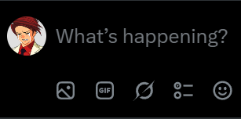
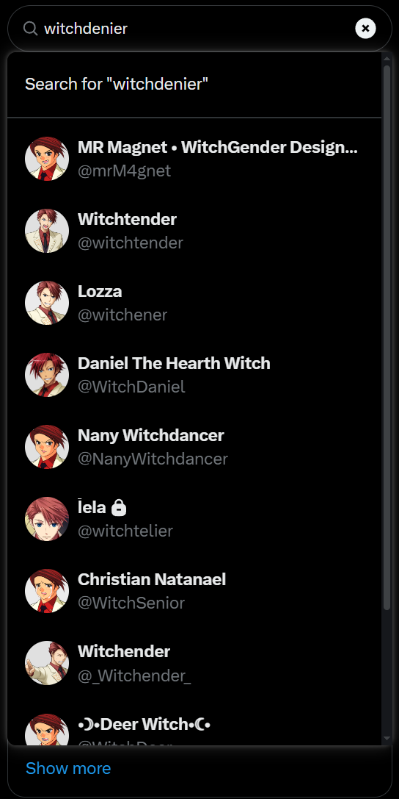
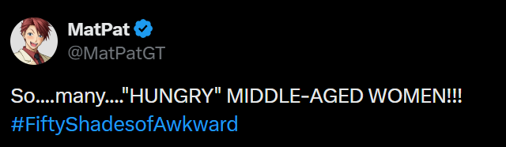

# Battler Avatar Replacer

Chrome extension built with Manifest V3, Vite, React, and TypeScript.

Replaces Twitter/X avatars with images of Ushiromiya Battler from the Umineko series.

<p></p>
<p></p>
<p></p>

## Install

1. Download the latest release zip.
2. Extract it.
3. Open `chrome://extensions`.
4. Enable `Developer mode`.
5. Click `Load unpacked`.
6. Select the extracted `dist` folder.

## Development

```bash
npm install
npm run build
npm run dev
```

Run `npm run build` for a production build.
